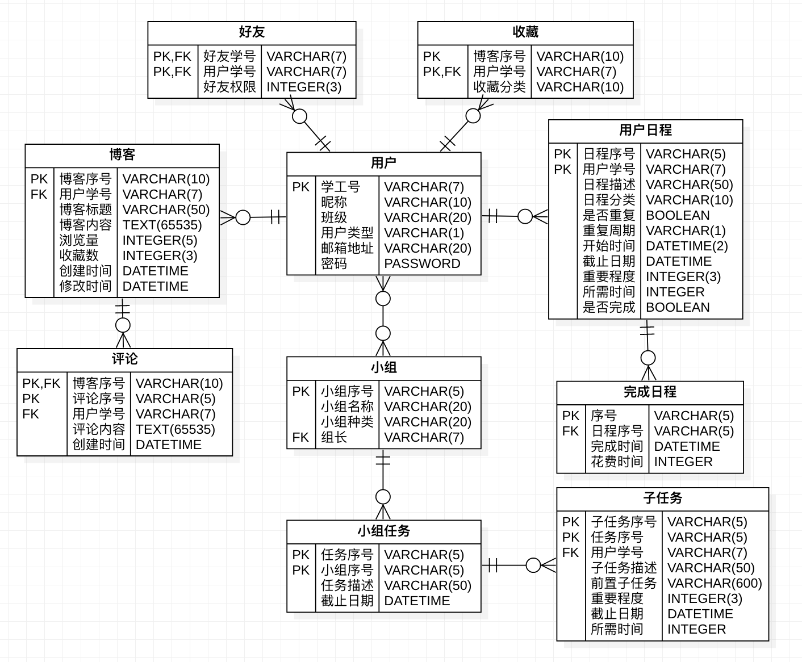

# 同济19信管Web小学期实践——学习助手

## 1 功能设计

## 2 数据库设计

根据功能需求，抽象出以下实体以及实体之间的联系，绘制出ER图：

在本项目中，利用Django的对象关系映射（ORM）模块，使用类和对象对数据库进行操作。对于实体、联系以及实体中各字段的说明如下：

### 2.1 用户（User，Profile）

学/工号（username）：由于系统服务于同济师生，该字段为最长为7个字符的字符串；

邮箱地址（email）：用户的邮箱地址，用于登录；

密码（password）：用户的密码，Django实现密码的哈希加密；

姓名/昵称（name）：用户自定义的昵称，最大长度为10个字符；

性别（gender）：用户的性别，包括M（男性）与F（女性）；

用户类型（type）：包括S（学生）与T（教师）；

班级（class_name）：用户所在的班级名称或院系，允许空。

值得注意的是，Django中有现成User类，只需要`from django.contrib.auth.models import User`。该类中，有属性`id`作为主键，且每个用户具有唯一的属性`username`，故将该属性作为学/工号。另外，对于Django自带的User类中未提供的字段，我们采取新建Profile类、将其和User建立一对一关系的方法实现。

### 2.2 小组（Group）

小组序号（id）：小组的序号，是Django自建的主键；

小组名称（group_name）：小组的名称，最大长度为20个字符。

小组与用户是多对多的关系，即一个用户可以在多个小组，一个小组可以有多个用户。Django在根据定义的类进行建表时，会建立一张存储小组与成员关系的表。

### 2.3 用户日程（Schedule）

日程序号（schedule_id）：日程的序号；

日程描述（description）：对于日程的描述，最大长度为50个字符；

日程类型（type）：日程类型，例如学习类、运动类等，最大长度为5个字符；

是否重复（is_repeated）：日程是否需要按周期重复，例如每天、每周、每月；

重复周期（repeat_cycle）：包括D（每天）、W（每周）与M（每月）， 允许空；

开始时间（start_time）、结束时间（end_time）、截止日期（deadline）：日程的开始、结束时间和截止日期；

权重（weight）：日程的重要程度；

预计所需时间（expected_minutes_consumed）：预计完成该日程需要花费的时间，以分钟为单位，允许空。

用户与用户日程是一对多的关系，因此添加属性用户（user）。用户与日程序号作为共同主键。

### 2.4 小组任务（GroupAssignment）

任务序号（assignment_id）：任务的序号；

任务描述（description）：对于任务的描述；

截止日期（deadline）：任务的截止日期。

小组与小组任务是一对多的关系，因此添加属性小组（group）。小组与任务序号作为共同主键。

### 2.5 子任务（SubAssignment）

子任务是对小组任务的分解，将小组任务分解给每位小组成员。

子任务序号（assignment_id）：作业的序号；

前置子任务（pre_sub_assignment）：为了完成该任务所需要的前置子任务，字符串类型；

用户（user）：负责完成该任务的小组成员；

任务描述（description）：对于子任务的描述；

截止日期（deadline）：子任务的截止日期；

权重（weight）：子任务的重要程度；

预计所需时间（expected_minutes_consumed）：预计完成该子任务需要花费的时间，以分钟为单位，允许空。

任务与子任务是一对多的关系，因此添加属性任务（assignment）。任务与子任务序号作为共同主键。

### 2.6 博客（Blog）

博客序号（id）：博客的序号，是Django自建的主键；

用户（user）：博客的作者；

标题（title）：博客的标题，最大长度为50个字符；

内容（content）、浏览量（pageview）、收藏量（collect_amount）：博客的内容、浏览量与收藏量。

### 2.7 评论（Comment）

评论序号（comment_id）：评论的序号；

用户（user）：评论博客的用户；

内容（content）：评论的内容。

博客与评论是一对多的关系，因此添加属性博客（blog）。博客与评论序号作为共同主键。

### 2.8 好友（Friend）

用户（user）、好友（friend）：用户以及其好友；

权限（authority）：以整数存储，表示用户开放给好友的查看权限。

用户与好友作为共同主键。

### 2.9 收藏（Collection）

用户（user）、博客（blog）：用户以及其收藏的博客；

种类（type）：收藏的种类。

用户与博客作为共同主键。

综上，建立的Django中的[models.py](helper/models.py)文件。

## 3 主要界面

### 3.1 用户相关界面

#### 3.1.1 注册界面

该界面用于用户的注册，URL为`/register`。

若请求为GET方法，无请求参数，返回参数为表单`form`，`form`包括的字段有：

|    字段    |     说明     |  类型  |             备注             | 是否必填 |
| :--------: | :----------: | :----: | :--------------------------: | :------: |
|  user_id   |   学/工号    |  Char  |   max_length=7，有效、唯一   |    是    |
|   email    |     邮箱     | Email  |          有效、唯一          |    是    |
| user_name  |     昵称     |  Char  |        max_length=10         |    是    |
|   gender   |     性别     | Choice |   ('M', '男'), ('F', '女')   |    是    |
| user_type  |   用户类型   | Choice | ('S', '学生'), ('T', '教师') |    是    |
| class_name |     班级     |  Char  |        max_length=20         |    否    |
| password1  |     密码     |  Char  |          不少于6位           |    是    |
| password2  | 再次输入密码 |  Char  |             一致             |    是    |

若请求为POST方法，请求参数为表单`form`，验证表单有效后创建用户，重定向至登录界面。

#### 3.1.2 登录界面

该界面用于用户的登录，URL为`/`。

若请求为GET方法，无请求参数，返回参数为表单`form`，`form`包括的字段有：

|    字段    |     说明     |  类型  |             备注             | 是否必填 |
| :--------: | :----------: | :----: | :--------------------------: | :------: |
|   email    |     邮箱     | Email  |          有效、存在          |    是    |
| password  |     密码     |  Char  |                     |    是    |

若请求为POST方法，请求参数为表单`form`，验证密码正确后重定向至个人主页，否则返回表单`form`与错误提示信息`message`，提示“密码错误，请重新输入！”。

#### 3.1.3 修改密码界面

该界面用于用户修改密码，URL为`/user/<int:pk>/pwd_change/`。

若请求为GET方法，请求参数为用户的id（即URL中的变量`pk`），返回参数为表单`form`与用户`user`，`form`包括的字段有：

|     字段     |     说明     | 类型 |   备注    | 是否必填 |
| :----------: | :----------: | :--: | :-------: | :------: |
| old_password |   旧的密码   | Char |           |    是    |
|  password1   |     密码     | Char | 不少于6位 |    是    |
|  password2   | 再次输入密码 | Char |   一致    |    是    |

若请求为POST方法，请求参数为表单`form`，验证旧密码正确后重定向至登录界面，否则返回表单`form`与错误提示信息`message`，提示“旧密码错误！”。

#### 3.1.4 个人主页

#### 3.1.5 登出

用于用户退出登录，URL为`/logout/`。

请求为GET方法，无请求参数，退出登录后重定向至登录界面。